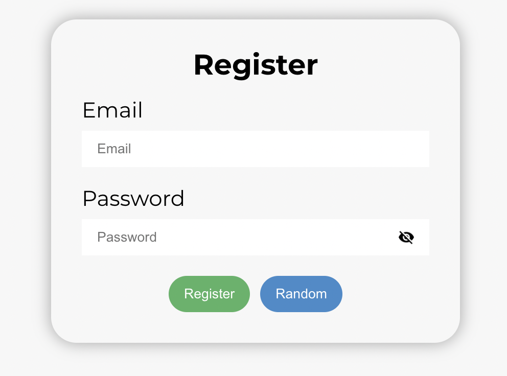
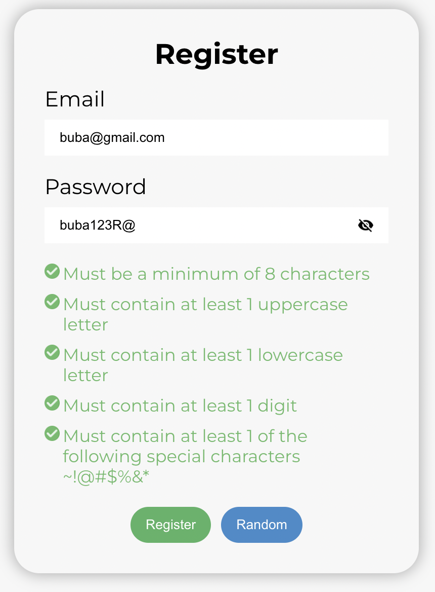

## Input-password-widget

The input password widget component is a highly secure and user-friendly component designed for capturing and validating password inputs in web applications. It provides an intuitive and visually pleasing interface for users to enter their passwords while ensuring that the password remains confidential and protected from unauthorized access.

This widget component offers a range of features to enhance the user experience and strengthen the overall security of password inputs. It incorporates advanced encryption techniques and hashing algorithms to securely transmit and store password data, minimizing the risk of data breaches and unauthorized access.

The component's design focuses on usability and accessibility, allowing users to easily interact with the password field and providing clear visual feedback on the strength and validity of their passwords. It includes interactive visual indicators that dynamically update as users type, giving real-time feedback on the complexity and strength of the password, such as password strength meter and requirements checklist.

To further enhance security, the input password widget component supports additional features such as password visibility toggling. This allows users to toggle between displaying the password as plain text or hiding it behind dots or asterisks, ensuring privacy in sensitive environments.

The component is highly customizable, allowing developers to configure various aspects such as input styling, validation rules, and error messages. It seamlessly integrates into existing web applications, providing a simple and straightforward integration process.

## Installation

## Usage
