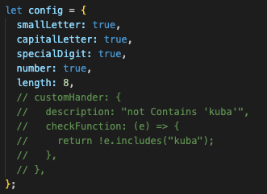

## Input-password-widget

The input password widget component is a highly secure and user-friendly component designed for capturing and validating password inputs in web applications. It provides an intuitive and visually pleasing interface for users to enter their passwords while ensuring that the password remains confidential and protected from unauthorized access.

This widget component offers a range of features to enhance the user experience and strengthen the overall security of password inputs. It incorporates advanced encryption techniques and hashing algorithms to securely transmit and store password data, minimizing the risk of data breaches and unauthorized access.

The component's design focuses on usability and accessibility, allowing users to easily interact with the password field and providing clear visual feedback on the strength and validity of their passwords. It includes interactive visual indicators that dynamically update as users type, giving real-time feedback on the complexity and strength of the password, such as password strength meter and requirements checklist.

To further enhance security, the input password widget component supports additional features such as password visibility toggling. This allows users to toggle between displaying the password as plain text or hiding it behind dots or asterisks, ensuring privacy in sensitive environments.

The component is highly customizable, allowing developers to configure various aspects such as input styling, validation rules, and error messages. It seamlessly integrates into existing web applications, providing a simple and straightforward integration process.

## Installation

To use the input password widget component, follow these steps:

Install the component: Begin by installing the input password widget component via npm or by including it in your project's dependencies.

Import the component: In the file where you want to use the input password widget, import the component using the appropriate import statement.

Set up the configuration: Create a configuration object that defines the validation rules and constraints for the password. Based on the data you provided, your configuration object could look like this:

The configuration object allows you to set various flags to control which validation rules should be applied. For example, if you want to enforce the inclusion of at least one small letter in the password, set smallLetter to true. If you don't want to enforce a specific rule, set the corresponding flag to false. Feel free to customize the configuration based on your specific requirements.

Integrate the component: Add the input password widget component to your desired location within your web application's user interface. You can pass the configuration object as a prop or parameter to the component, allowing the widget to adapt its behavior accordingly.

Implement custom validation (optional): If you have additional validation requirements beyond the predefined rules, you can implement your own validation function. This function can be passed as a prop or parameter to the component, enabling you to perform custom checks on the password input. For example, you may want to enforce the absence of certain words or patterns specific to your application.

Handle the password input: As users interact with the input password widget, you can access the entered password through event handlers or by listening for specific events triggered by the component. You can then perform additional operations, such as storing the password securely or triggering further actions based on the validity of the password.

By following these steps and customizing the configuration object according to your requirements, you can effectively utilize the input password widget component in your web application. It provides a seamless and secure way for users to input passwords while allowing you to enforce specific validation rules and incorporate custom logic as needed.
